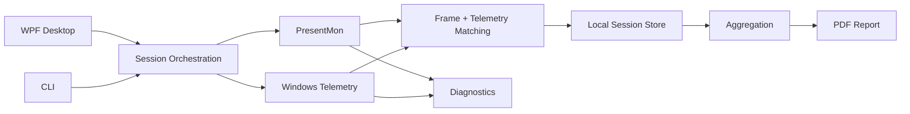

# ZykeMark

ZykeMark is a Windows benchmarking app for capturing frame-time data with PresentMon and combining it with process telemetry. Each benchmark is stored as a local session and can be summarized or exported as a PDF report.

The project has a WPF desktop UI and a CLI. It is a working development build, but there is no installer or packaged release yet.

## Features

- PresentMon frame capture on Windows
- CPU, memory, disk and available GPU/VRAM telemetry
- support for both single-process and multi-process targets
- local session storage with raw chunks, diagnostics and aggregates
- average FPS, frame time, 1% low and 0.1% low FPS
- PDF report generation
- WPF desktop UI
- CLI commands for capture, diagnostics and repeatable test runs

## Architecture



The solution is split into four projects:

- `ZykeMark.App.Desktop` - WPF UI and desktop session flow
- `ZykeMark.App.Cli` - CLI workflows and diagnostics
- `ZykeMark.Core` - domain models, sessions and aggregation
- `ZykeMark.Infrastructure` - PresentMon, ETW, Windows telemetry and reporting

More detail: [docs/architecture.md](docs/architecture.md)

## Capture reliability

Most of the work ended up being around real Windows capture rather than the UI. A few examples:

| Problem | Cause | Fix |
| --- | --- | --- |
| PresentMon exited `0` but wrote no CSV | process-name matching expected the executable name, while `.NET Process.ProcessName` omitted `.exe` | normalize names before building PresentMon arguments and verify the output file |
| Browser/Electron captures returned no frames | the selected PID was not always the process presenting frames | prefer process-name capture for known multi-process apps |
| Later captures failed with ETW error `1450` | stale ETW sessions survived failed runs | clean stale ZykeMark ETW sessions and retry once |
| Telemetry values were attached to the wrong frames | the latest telemetry sample was reused after capture | timestamp samples and match them to frame timestamps |

The longer debugging notes are in [docs/engineering-notes.md](docs/engineering-notes.md).

## Tech stack

- C# / .NET 8
- WPF
- CommunityToolkit.Mvvm
- WPF-UI
- PresentMon / ETW
- Windows Performance Counters
- QuestPDF
- xUnit

## Build

Requirements:

- Windows for the desktop app and real telemetry capture
- .NET 8 SDK
- PresentMon for real frame capture

```powershell
git clone https://github.com/Gencalp/ZykeMark.git
cd ZykeMark

dotnet restore
dotnet build ZykeMark.sln -c Release
dotnet test ZykeMark.sln -c Release --no-build
```

Run the desktop app:

```powershell
dotnet run --project src/ZykeMark.App.Desktop
```

## CLI

Run a deterministic simulated benchmark without PresentMon:

```powershell
dotnet run --project src/ZykeMark.App.Cli -- demo-run --seconds 15 --seed 123
```

Run a real capture:

```powershell
dotnet run --project src/ZykeMark.App.Cli -- real-run --process_name "MyGame.exe" --seconds 15 --presentmon-path "C:\tools\PresentMon.exe"
```

Check telemetry for a process:

```powershell
dotnet run --project src/ZykeMark.App.Cli -- test-telemetry --process_id 1234 --seconds 3
```

Export an existing session to PDF:

```powershell
dotnet run --project src/ZykeMark.App.Cli -- export-pdf --sessionId <session-id>
```

Sessions are stored under:

```text
%LOCALAPPDATA%\ZykeMark\sessions\<session-id>
```

## Tests

The test suite covers the areas that caused real capture bugs during development, including:

- PresentMon argument construction and process-name normalization
- PresentMon path discovery
- CSV parsing across header/time variants
- ETW cleanup and warning parsing
- elevation fallback behavior
- GPU telemetry PID matching
- frame-to-telemetry timestamp matching
- session aggregation
- PDF report generation

Fixture CSVs are included so parser tests do not require a live capture.

## Current limitations

- Windows only
- no installer or packaged release
- PresentMon is required for real frame capture
- hardware coverage is still limited to the machines used during development

Current scope: [docs/mvp-scope.md](docs/mvp-scope.md)

## License

No open-source license is granted at this time.
