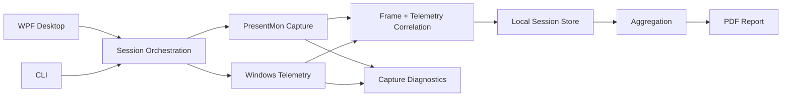

# ZykeMark

A Windows benchmarking tool for capturing frame-time data and system telemetry, then turning a benchmark session into useful performance summaries and PDF reports.

ZykeMark started as a small CLI experiment and grew into a desktop application after the difficult part became clear: collecting reliable real-world telemetry is less about drawing charts and more about handling process models, PresentMon/ETW failure modes, stale sessions, timestamp correlation and partial data without hiding what went wrong.

> **Status:** working engineering project and portfolio build. The core capture, telemetry, session, diagnostics and reporting paths are implemented and covered by automated tests. ZykeMark is not distributed as an end-user installer yet.

## What it does

- Captures frame presentation data with **PresentMon** on Windows.
- Samples process telemetry including CPU, memory, disk and available GPU/VRAM counters.
- Handles single-process and multi-process applications differently when targeting frame capture.
- Persists benchmark sessions locally with metadata, raw chunks, diagnostics and aggregates.
- Produces metrics such as average FPS, frame time, 1% low and 0.1% low FPS.
- Generates PDF benchmark reports.
- Includes a WPF desktop UI plus CLI commands for testing, diagnostics and repeatable workflows.

## Why I built it

I wanted a benchmarking workflow where the difficult runtime behavior was visible instead of silently failing. During development, several issues only appeared on real machines: PresentMon could exit successfully without producing data, ETW sessions could remain stuck, browsers could render in child GPU processes, and telemetry samples needed timestamp-aware matching to frame data.

Those problems shaped the project more than the UI did. The repository therefore contains explicit diagnostics, retry logic and tests around the failure paths rather than treating capture as a single happy-path command.

## Architecture



The solution is split into four main areas:

- **ZykeMark.App.Desktop** — WPF desktop UI and session orchestration.
- **ZykeMark.App.Cli** — command-line workflows and developer diagnostics.
- **ZykeMark.Core** — domain models, session management and aggregation.
- **ZykeMark.Infrastructure** — PresentMon integration, ETW handling, telemetry and PDF reporting.

See [docs/architecture.md](docs/architecture.md) for the boundaries in more detail and [docs/engineering-notes.md](docs/engineering-notes.md) for the hardest reliability problems solved during development.

## A hard problem: reliable process capture

One recurring failure looked harmless: PresentMon could print that recording started and stopped, exit with code `0`, and still produce no CSV.

The root causes varied by target:

- `.NET Process.ProcessName` omits the `.exe` suffix while PresentMon process-name matching expects it.
- Browsers and Electron applications often render in child GPU processes, making PID-only targeting incomplete.
- Non-elevated process-name capture can fail even when PID capture works.
- Stale ETW sessions can produce error `1450` or leave subsequent captures unreliable.

The current implementation normalizes process names, chooses process-name capture for known multi-process applications, retries selected failures with PID targeting, cleans stale ETW sessions and records detailed capture diagnostics for failed runs.

That debugging path is documented in [docs/engineering-notes.md](docs/engineering-notes.md).

## Tech stack

- **C# / .NET 8**
- **WPF** + CommunityToolkit.Mvvm + WPF-UI
- **PresentMon / ETW**
- Windows Performance Counters
- **QuestPDF**
- **xUnit**

## Build and test

Requirements:

- Windows for the desktop application and real telemetry capture
- .NET 8 SDK
- PresentMon for real frame capture

```powershell
git clone https://github.com/Gencalp/ZykeMark.git
cd ZykeMark

dotnet restore
dotnet build ZykeMark.sln -c Release
dotnet test ZykeMark.sln -c Release --no-build
```

Run the desktop application:

```powershell
dotnet run --project src/ZykeMark.App.Desktop
```

## CLI examples

A deterministic simulated benchmark can be run without PresentMon:

```powershell
dotnet run --project src/ZykeMark.App.Cli -- demo-run --seconds 15 --seed 123
```

A real Windows capture can target either a process name or PID:

```powershell
dotnet run --project src/ZykeMark.App.Cli -- real-run --process_name "MyGame.exe" --seconds 15 --presentmon-path "C:\tools\PresentMon.exe"
```

Developer telemetry check:

```powershell
dotnet run --project src/ZykeMark.App.Cli -- test-telemetry --process_id 1234 --seconds 3
```

Generate a report for an existing session:

```powershell
dotnet run --project src/ZykeMark.App.Cli -- export-pdf --sessionId <session-id>
```

Sessions are stored under:

```text
%LOCALAPPDATA%\ZykeMark\sessions\<session-id>
```

A session can contain metadata, frame chunks, `summary.json`, capture/telemetry diagnostics and an exported PDF report.

## Testing philosophy

The test suite focuses heavily on the places where real capture failed during development, including:

- PresentMon argument building and process-name normalization
- PresentMon path discovery
- CSV parsing across header/time variants
- ETW cleanup and warning parsing
- elevation retry behavior
- GPU telemetry PID matching
- frame-to-telemetry timestamp attachment
- aggregation and session flow
- PDF report generation

The repository also includes fixture CSVs so parser behavior remains repeatable without requiring a live capture for every test.

## Project scope

ZykeMark is currently a Windows-first engineering project rather than a packaged commercial product. The next productization steps would be installer/release packaging, broader hardware validation and a more polished first-run dependency setup.

Current scope is documented in [docs/mvp-scope.md](docs/mvp-scope.md).

## Repository notes

This repository is primarily shared as a portfolio and engineering case study. No open-source license is currently granted.