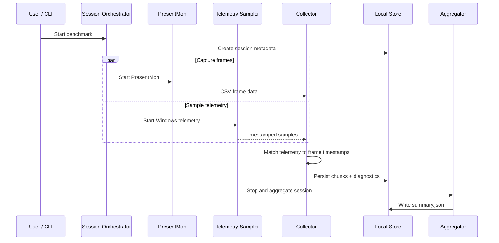

# ZykeMark Architecture

## Overview

ZykeMark is a Windows-first benchmarking application that combines frame-presentation data from PresentMon with process telemetry, persists each benchmark as a local session, computes aggregate metrics and can generate a PDF report.

The design keeps capture, domain logic, storage and presentation concerns separate so runtime failures can be isolated and tested without requiring the whole desktop application.

## Solution boundaries

### `ZykeMark.App.Desktop`

WPF desktop application.

Responsibilities:

- process selection and benchmark configuration
- session start/stop orchestration
- dependency/status feedback for PresentMon
- live session state and completed-session browsing
- wiring user settings into the capture pipeline

### `ZykeMark.App.Cli`

Command-line entry point for repeatable workflows and developer diagnostics.

Responsibilities:

- simulated benchmark runs
- real PresentMon capture
- isolated telemetry checks
- diagnostic capture workflows
- PDF export

The CLI is useful when debugging a capture problem independently of the WPF UI.

### `ZykeMark.Core`

Domain layer with minimal platform-specific behavior.

Responsibilities:

- session metadata and capture targets
- frame and telemetry models
- local session lifecycle
- aggregation of benchmark metrics
- abstractions for collectors, storage and telemetry

### `ZykeMark.Infrastructure`

Windows/runtime integrations.

Responsibilities:

- PresentMon path resolution and process execution
- PresentMon CSV parsing
- ETW session discovery and cleanup
- Windows performance-counter telemetry
- capture and telemetry diagnostics
- PDF report generation

## Runtime data flow



## Capture targeting

The capture target contains a process name, PID or both.

ZykeMark does not assume every application follows the same process model:

- conventional single-process targets can use PID-based capture
- known multi-process applications such as browsers and Electron applications can prefer process-name targeting so renderer/GPU child processes are not missed
- selected process-name failures can fall back to PID-based capture

This behavior exists because real capture reliability depended on target process structure, not just a single identifier.

## Reliability and diagnostics

Capture failures are treated as observable states rather than generic exceptions.

The infrastructure layer records information such as:

- resolved PresentMon executable
- generated arguments
- exit code and process output
- discovered CSV path and size
- parsed header/row information
- ETW cleanup/retry activity
- telemetry PID matching information

This allows a failed benchmark to be investigated from files in the session folder without reproducing the exact UI state.

## Storage

Sessions are stored locally under:

```text
%LOCALAPPDATA%\ZykeMark\sessions\<session-id>
```

A session can include:

- metadata
- raw frame chunks
- `summary.json`
- capture diagnostics
- telemetry diagnostics
- generated PDF reports

## Testing seams

The project keeps interfaces around PresentMon execution, ETW management and telemetry so failure behavior can be tested with fakes and fixture CSV files.

Representative coverage includes:

- PresentMon argument construction
- parser compatibility across CSV variants
- stale ETW cleanup
- elevation/fallback logic
- multi-process GPU PID matching
- timestamp-based telemetry attachment
- session aggregation and report generation
