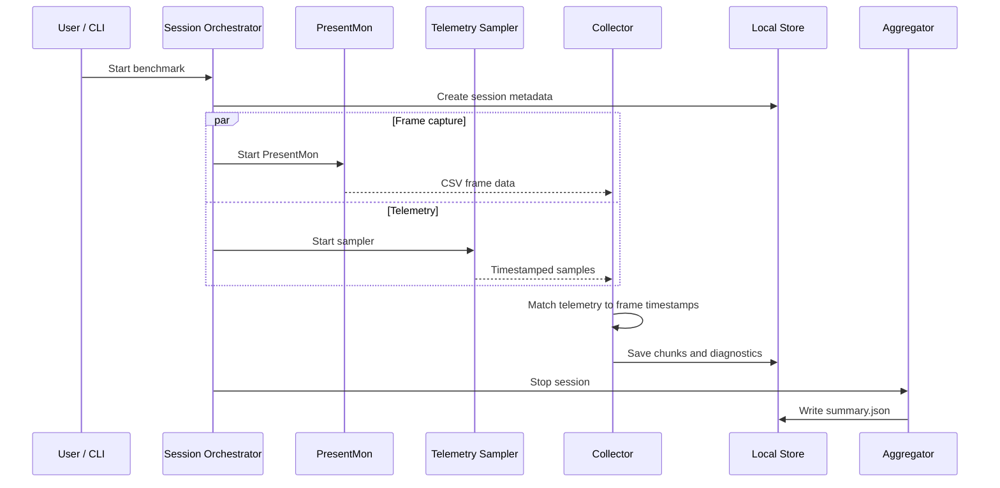

# ZykeMark Architecture

ZykeMark is split into four projects so the Windows-specific capture code stays separate from the session/domain logic.

## Projects

### `ZykeMark.App.Desktop`

WPF application.

Main responsibilities:

- process selection
- benchmark configuration
- session start/stop
- PresentMon dependency/status feedback
- live and completed session views

### `ZykeMark.App.Cli`

Command-line entry point used for repeatable runs and diagnostics.

Commands cover:

- simulated benchmarks
- real PresentMon capture
- telemetry checks
- diagnostic capture
- PDF export

The CLI is useful when debugging capture without involving the WPF UI.

### `ZykeMark.Core`

Platform-light domain code.

Contains:

- session metadata
- capture targets
- frame/telemetry models
- session lifecycle
- aggregation
- interfaces used by infrastructure code

### `ZykeMark.Infrastructure`

Windows integrations and output generation.

Contains:

- PresentMon path resolution and process execution
- PresentMon CSV parsing
- ETW session cleanup
- Windows telemetry sampling
- capture/telemetry diagnostics
- PDF reports

## Runtime flow



## Capture target

A target can contain a process name, PID or both.

For normal single-process applications, PID capture is usually enough. For browsers and Electron apps, process-name capture can be used so renderer/GPU child processes are not missed. Selected process-name failures can fall back to PID capture.

## Diagnostics

The capture layer records enough runtime detail to investigate failed sessions without reproducing the UI state.

Examples:

- resolved PresentMon executable
- command-line arguments
- exit code/stdout/stderr
- CSV path and size
- parsed row/header information
- ETW cleanup/retry activity
- telemetry PID matching

## Storage

Sessions are stored under:

```text
%LOCALAPPDATA%\ZykeMark\sessions\<session-id>
```

A session may contain:

- metadata
- raw frame chunks
- `summary.json`
- capture diagnostics
- telemetry diagnostics
- PDF reports

## Tests

Interfaces around PresentMon, ETW and telemetry make the failure paths testable with fakes and fixture CSVs.

Coverage includes:

- PresentMon argument construction
- CSV parser variants
- ETW cleanup
- elevation fallback
- GPU PID matching
- timestamp-based telemetry attachment
- session aggregation
- PDF report generation
